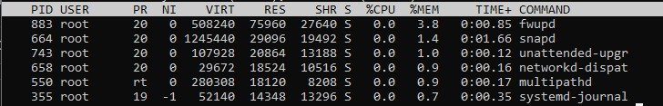
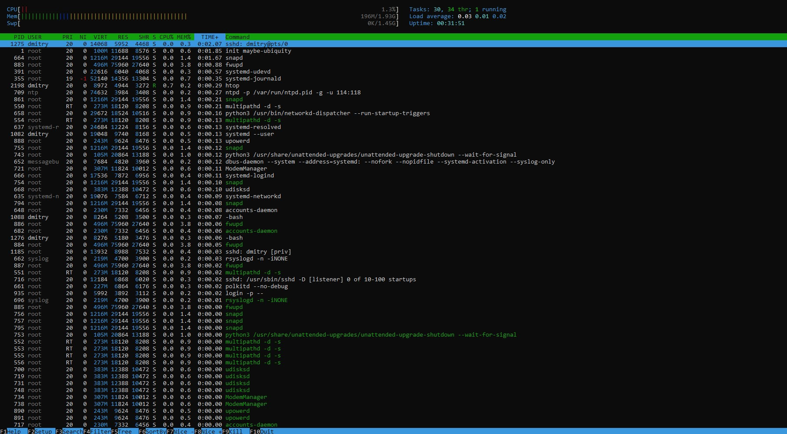
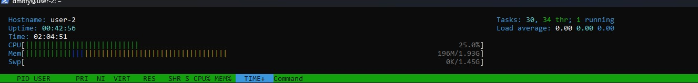

---
layout:
  title:
    visible: false
  description:
    visible: false
  tableOfContents:
    visible: false
  outline:
    visible: false
  pagination:
    visible: false
---

# Report

## Report

### Part 1. Установка ОС

1. Проверка установленной версии

<figure><figcaption>
Проверка установленной версии
</figcaption></figure>

### Part 2. Создание пользователя

1. Вставьте скриншот вызова команды для создания пользователя.

<figure><figcaption>
Создание нового пользователя и назначение роли adm
</figcaption></figure>

2. Новый пользователь должен быть в выводе команды\
   `cat /etc/passwd`

<figure><figcaption>
Вывод /etc/passwd
</figcaption></figure>

3. Вставьте скриншот с выводом команды.

<figure><figcaption>
dmitry_new в списке /etc/passwd
</figcaption></figure>

### Part 3. Настройка сети ОС

1. Задать название машины вида user-1

<figure><figcaption>
Изменение имени машины на  user-1
</figcaption></figure>

2. Установить временную зону, соответствующую вашему текущему местоположению.

<figure><figcaption>
Временная зона
</figcaption></figure>

3. Вывести названия сетевых интерфейсов с помощью консольной команды.

<figure><figcaption>
Сетевые интерфейсы
</figcaption></figure>

* `lo` это "loopback" интерфейс или "локальный интерфейс". Он используется для обмена данными между приложениями на вашем собственном компьютере. Например,  `localhost` или `127.0.0.1 -` это адрес интерфейса `lo`, который позволяет вам взаимодействовать с вашим собственным компьютером через сетевой стек. Интерфейс `lo` считается всегда активным и не требует физического подключения.

4. Используя консольную команду получить ip адрес устройства, на котором вы работаете, от DHCP сервера.

<figure><figcaption>
Получение dhclient
</figcaption></figure>

* DHCP-сервер не предоставил новый IP-адрес или устройство уже имеет IP-адрес, полученный ранее.
* DHCP (Dynamic Host Configuration Protocol) - это протокол сетевого уровня, который позволяет устройствам автоматически получать IP-адреса, настройки сети, шлюзы, DNS-серверы и другую информацию от DHCP-сервера в сети.

5. Определить и вывести на экран внешний ip-адрес шлюза (ip) и внутренний IP-адрес шлюза, он же ip-адрес по умолчанию (gw).

<figure><figcaption>
ip и gw для настройки сети
</figcaption></figure>

6. Задать статичные (заданные вручную, а не полученные от DHCP сервера) настройки ip, gw, dns (использовать публичный DNS серверы, например 1.1.1.1 или 8.8.8.8).

<figure><figcaption>
Файл с настройками ip, gw и dns
</figcaption></figure>

<figure><figcaption>
Статическая настройка сети
</figcaption></figure>

<figure><figcaption>
Применили изменения
</figcaption></figure>

7. Перезагрузить виртуальную машину. Убедиться, что статичные сетевые настройки (ip, gw, dns) соответствуют заданным в предыдущем пункте.

<figure><figcaption>
Перезагрузка виртуальной машины
</figcaption></figure>

<figure><figcaption>
ip и gw сохранились
</figcaption></figure>

<figure><figcaption>
ping 1.1.1.1 и ping ya.ru проходят без потери пакетов
</figcaption></figure>

### Part 4. Обновление ОС

<figure><figcaption>
Все пакеты обновлены
</figcaption></figure>

### Part 5. Использование команды **sudo**

<figure><figcaption>
Даем права dmitry_new для доступа к команде sudo
</figcaption></figure>

<figure><figcaption>
 Изменение hostnamectl через sudo dmitry_new
</figcaption></figure>

<figure><figcaption>
Имя успешно изменено
</figcaption></figure>

### Part 6. Установка и настройка службы времени

<figure><figcaption>
Автоматическая синхронизация времени настроена.
</figcaption></figure>

### Part 7. Установка и использование текстовых редакторов

1. Используя каждый из трех выбранных редакторов, создайте файл _test\_X.txt_, где X -- название редактора, в котором создан файл. Напишите в нём свой никнейм, закройте файл с сохранением изменений.

* Внутри редактора Vim, нажимаем клавишу "i" для перехода в режим редактирования, затем нажмите клавишу "Esc" и вводим команду ":wq"

<figure><figcaption>
vim редактор
</figcaption></figure>

* Внутри редактора Nano, пишем свой ник, затем нажимаем клавишу "Ctrl" + "O" для сохранения и "Ctrl" + "X" для выхода.

<figure><figcaption>
nano редактор
</figcaption></figure>

* Внутри редактора Joe, пишем никнейм, затем нажимаем клавишу "Ctrl" + "K" и "X" для сохранения и выхода.

<figure><figcaption>
joe редактор
</figcaption></figure>

2. Используя каждый из трех выбранных редакторов, откройте файл на редактирование, отредактируйте файл, заменив никнейм на строку "21 School 21", закройте файл без сохранения изменений.

* &#x20;Нажимаем клавишу "Esc" для выхода из режима редактирования. Вводим команду `:q!` и нажмите "Enter" для выхода без сохранения изменений.

<figure><figcaption>
Внесенные изменения через vim
</figcaption></figure>

* Нажимаем "Ctrl" + "X" для выхода. При запросе о сохранении изменений, нажимаем "N" (No) для отказа от сохранения.

<figure><figcaption>
Внесение изменений через nano
</figcaption></figure>

* Нажимаем "Ctrl" + "C" для выхода. При запросе о сохранении изменений, нажимаем "N" (No) для отказа от сохранения.

<figure><figcaption>
Внесение изменений через joe
</figcaption></figure>

3. Используя каждый из трех выбранных редакторов, отредактируйте файл ещё раз (по аналогии с предыдущим пунктом), а затем освойте функции поиска по содержимому файла (слово) и замены слова на любое другое.

* Vim

<figure><figcaption>
Поиск через vim: /Linux
</figcaption></figure>

<figure><figcaption>
Замена через vim
</figcaption></figure>

* Nano

<figure><figcaption>
Поиск через nano: Ctrl + /
</figcaption></figure>

<figure><figcaption>
Для замены Alt + R. Вводим, что ищем. Затем на что заменяем. Затем подтверждаем.
</figcaption></figure>

* Joe

<figure><figcaption>
Поиск через Ctrl +K F. Вводим слово, предлагаются варианты, что с ним делать.
</figcaption></figure>

<figure><figcaption>
Замена: в режиме поиска нажимаем R затем новое слово, затем подтверждаем.
</figcaption></figure>

### Part 8. Установка и базовая настройка сервиса **SSHD**

1. Установка SSH сервера (SSHd)

<figure><figcaption>
Установка openssh-server
</figcaption></figure>

2. Добавить автостарт службы при загрузке системы.

<figure><figcaption>
Автостарт службы при старте системы
</figcaption></figure>

3. Перенастроить службу SSHd на порт 2022.

<figure><figcaption>
sudo vim /etc/ssh/sshd_config
</figcaption></figure>

<figure><figcaption>
Перезапуск службу SSHd
</figcaption></figure>

4. Используя команду ps, показать наличие процесса sshd. Для этого к команде нужно подобрать ключи.

<figure><figcaption></figcaption></figure>

* `ps`: Эта команда используется для отображения информации о текущих процессах.
* `-e`: Ключ, который указывает на отображение всех процессов, даже если они не привязаны к текущему терминалу (для всех пользователей).
* `aux`: Ключи, которые указывают на вывод всех процессов всех пользователей (включая процессы без терминала) в полном формате.
* `|`: Команда для перенаправления вывода предыдущей команды на вход следующей команды.
* `grep sshd`: Команда `grep` используется для поиска строк, содержащих "sshd".

5. Перезагрузить систему.

<figure><figcaption></figcaption></figure>

Значения столбцов вывода команды `netstat -tan`:

* `-tan`: Ключи, которые указывают на отображение всех TCP соединений, без разрешения имен, и в числовом формате.
* `tcp`: Протокол соединения (в данном случае TCP).
* `0`: Номер протокола, обычно не имеет значения для TCP.
* `0`: Номер порта или статус соединения на локальной машине.
* `0.0.0.0:2022`: Локальный адрес и порт (0.0.0.0 - все доступные интерфейсы, 2022 - порт).
* `0.0.0.0:*`: Удаленный адрес и порт (звездочка - любой порт на удаленной машине).
* `LISTEN`: Состояние сокета (прослушивание на порту).

Значение `0.0.0.0` означает, что соединение прослушивается на всех доступных сетевых интерфейсах.

### Part 9. Установка и использование утилит **top**, **htop**

1. **Top**

<figure><figcaption>
top
</figcaption></figure>

<figure><figcaption>
После сортировки по MEM
</figcaption></figure>

<figure><figcaption>
После сортировки по CPU
</figcaption></figure>

* `uptime`: Система работает 18 минут.
* Количество авторизованных пользователей: 2 пользователя.
* Общая загрузка системы: Загрузка системы за последние 1, 5 и 15 минут составляет 0.00, 0.06 и 0.10 соответственно.
* Общее количество процессов: Всего 100 процессов.
* Загрузка CPU: 0.0% пользовательских процессов, 6.2% системных процессов, 93.8% не используется.
* Загрузка памяти: Использовано 194.3 MiB из 1971.4 MiB доступной памяти.
* PID процесса, занимающего больше всего памяти: 883.
* PID процесса, занимающего больше всего процессорного времени: 1275.

2. Htop

* вывод отсортированный по PID, PERCENT\_CPU, PERCENT\_MEM, TIME

<figure><figcaption>
Фильтр по PID
</figcaption></figure>

<figure><figcaption>
Фильтр по PERCENT_CPU
</figcaption></figure>

<figure><figcaption>
Фильтр по PERCENT_MEM
</figcaption></figure>

<figure><figcaption>
Фильтр по TIME
</figcaption></figure>

* вывод отфильтрованный для процесса sshd

<figure><figcaption></figcaption></figure>

* вывод с процессом syslog, найденным, используя поиск

<figure><figcaption></figcaption></figure>

* вывод с добавленным выводом hostname, clock и uptime

<figure><figcaption></figcaption></figure>

### Part 10. Использование утилиты **fdisk**

<figure><figcaption></figcaption></figure>

* Название: VBOX HARDDISK
* Размер: 10 GiB (10737418240 байт)
* Количество секторов: 20971520

<figure><figcaption></figcaption></figure>

* Размер swap-раздела: 1.52 GiB (1518588 байт).

### Part 11. Использование утилиты **df**

1. **df**

<figure><figcaption></figcaption></figure>

Для корневого раздела (/):

* Размер раздела: 8408452 Кб (1K блоков).
* Размер занятого пространства: 4269944 Кб (1K блоков).
* Размер свободного пространства: 3689792 Кб (1K блоков).
* Процент использования: 54%.

Единица измерения в выводе: Кб (килобайты).

2. df -Th

<figure><figcaption></figcaption></figure>

Для корневого раздела (/):

* Размер раздела: 8.1G (гигабайт).
* Размер занятого пространства: 4.1G (гигабайт).
* Размер свободного пространства: 3.6G (гигабайт).
* Процент использования: 54%.
* Тип файловой системы: ext4.

### Part 12. Использование утилиты **du**

<figure><figcaption></figcaption></figure>

### Part 13. Установка и использование утилиты **ncdu**

<figure><figcaption>
ncdu /home
</figcaption></figure>

<figure><figcaption>
ncdu /var
</figcaption></figure>

<figure><figcaption>
ncdu /var/log
</figcaption></figure>

### Part 14. Работа с системными журналами

1. Написать в отчёте время последней успешной авторизации, имя пользователя и метод входа в систему.

<figure><figcaption></figcaption></figure>

* Время: 29 Aug 02:53:00
* Имя пользователя: dmitry
* Метод: Accepted password

2. Вставить в отчёт скрин с сообщением о рестарте службы (искать в логах).

<figure><figcaption></figcaption></figure>

### Part 15. Использование планировщика заданий **CRON**

<figure><figcaption></figcaption></figure>
